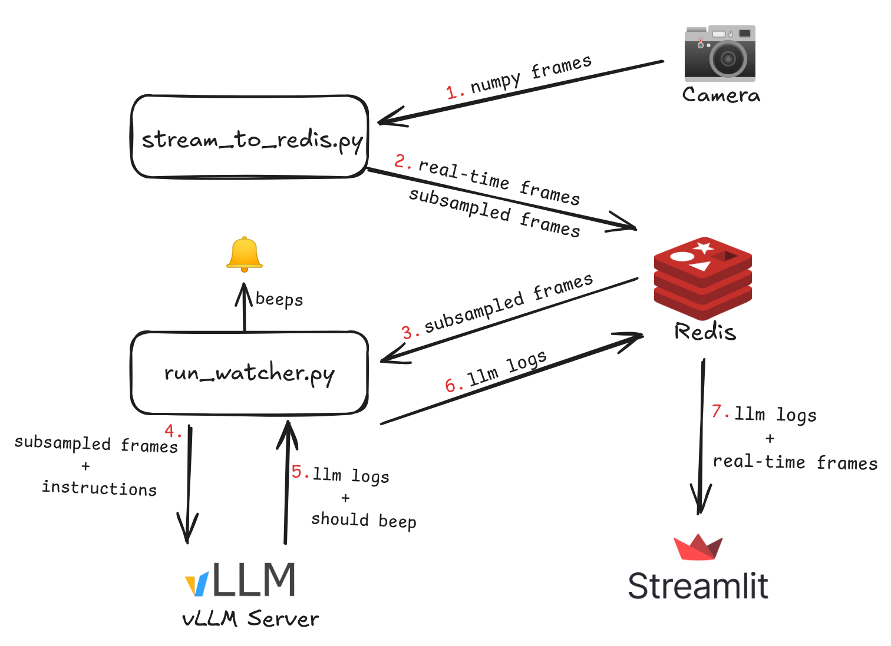

# 👶🧠 AI Baby Monitor (Local Video‑LLM Nanny)

[](LICENSE)

> **Your second pair of eyes, powered by local video LLMs. Because, you know... it does take a village.**

The **AI Baby Monitor** watches a video stream (webcam, RTSP camera,  …) and a simple list of safety rules. If a rule is broken it issues a *single* gentle beep so you can quickly glance at your baby to check in on them.


## 📸 Demo
Obviously, I'm not going to put my child in danger just for the demo, so here're videos of:
1. People using smartphones, when rules say you shouldn't ❌
2. Baby being safe and playful with a parent ✅

<table width="100%">
  <tr>
    <td align="center" width="65%">
      <video src="assets/demo_phone.mp4" height="350px" style="max-width: 100%;" controls autoplay loop muted>
        Your browser does not support the video tag.
      </video><br/>
      <sub>📵 "No smartphones" rule – alert fired</sub>
    </td>
    <td align="center" width="35%">
      <video src="assets/demo_baby.mp4" height="350px" style="max-width: 100%;" controls autoplay loop muted>
        Your browser does not support the video tag.
      </video><br/>
      <sub>👶 Baby walking – no alert</sub>
    </td>
  </tr>
</table>

---

## ✨ Features

|                       |                                                                                                                 |   |
| --------------------- | ----------------------------------------------------------------------------------------------------------------| - |
| 🛡️ **Private‑first**  | Everything runs locally; nothing ever leaves your network.                                                      |   |
| ⚡  **Realtime-ish**   | Works on consumer GPUs at ~1 req/s.                                                                             |   |
| 🦾 **Video LLM**      | Uses the [Qwen2.5 VL](https://huggingface.co/Qwen/Qwen2.5-VL-7B-Instruct-AWQ) by default, served through vLLM.  |   |
| 🔔 **One beep alert** | Deliberately minimal & quiet  —  just look when it beeps.                                                       |   |
| 🖥 **Live dashboard** | Streamlit viewer shows the live stream + LLM reasoning logs in real time.                                       |   |
| 📝 **Easy rules**     | "The baby shouldn’t climb out of the crib", "Baby should always be accompanied by adult" … just edit YAML.      |   |
| 🏘️ **Multi-rooms**    | Supports multiple rooms. Just add another YAML with instructions.                                               |   |

---

## 🚀 Quick start

> **Prerequisites** • Docker + docker‑compose • One GPU • Python 3.12 with [uv](https://github.com/astral-sh/uv)

```bash
# 1 — clone
$ git clone https://github.com/zeenolife/ai-baby-monitor.git && cd ai-baby-monitor

# 2 — copy .env.template into .env
$ cp .env.template .env

# 3 — build & start all services (Redis, vLLM, video streamer, Streamlit viewer)
$ docker compose up --build -d

# 4 — start the watcher on the **host**. unfortunately playing sound in Docker container and propagating to host is really painful. so no docker compose here
$ uv run scripts/run_watcher.py --config-file configs/living_room.yaml

# 5 — open the dashboard 👉 http://localhost:8501. You can also open the dashboard on your phone http://{host_network_ip}:8501
```

> **Heads‑up** The first run downloads the model (\~6 GB), builds docker image and may take a few minutes.

---

## 🛠 Configuration

Add or tweak rooms in `configs/*.yaml`:

```yaml
name: "living_room"

camera:
  uri: "0"            # webcam index or RTSP URI

instructions:          # natural‑language rules for the nanny model
  - "The baby shouldn't do anything dangerous."
  - "An adult should be in the room if the baby is awake."
```

* **Multiple rooms**? Edit `docker-compose.yml` and create `stream_to_redis` per room. Pass in new room config to streamlit viewer. Spawn new `run_watcher.py` process on host for new room config. 
* **Swap the model**? Set LLM_MODEL_NAME in .env. Check [vLLM supported models](https://docs.vllm.ai/en/latest/models/supported_models.html#list-of-multimodal-language-models)

---

## 🏗 Architecture (high level)
<center></center>  

---

1. **`stream_to_redis.py`** captures frames and pushes them to Redis (short *realtime* & long *subsampled* frames queues).
2. **`run_watcher.py`** pulls latest N frames, encodes instructions and frames into prompt and sends them to local vLLM server, receives structured JSON, writes logs & plays a beep if receives `should_alert = True`.
3. **Streamlit** live‑updates the latest frame + llm logs.

---

## 🛑 Disclaimer

This project is **NOT** a replacement for adult supervision. You should **NEVER** leave your baby alone.

It's meant as an additional guard for situations when you inevitably get distracted for a tiny moment, and your child
is doing something dangerous. Thus just a beep sound as a notification.

It’s an experimental hobby tool — use responsibly and at your own risk.

---

## 📝 License

[MIT](LICENSE) © 2025 @zeenolife


## Credits
Notification sound from [Mixkit](https://mixkit.co/), used under the Mixkit Free Sound Effects License.  
Videos used for demo from [Pexels](https://www.pexels.com/), used under their license